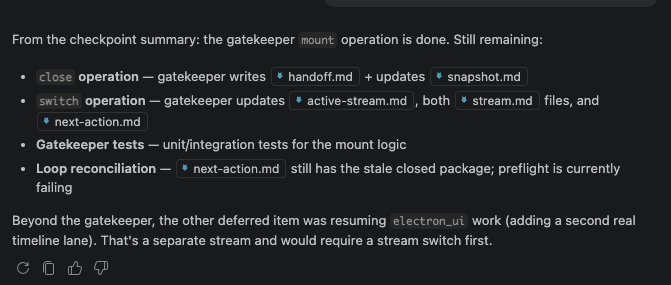

Consync checkpoint:
- gatekeeper mount implemented and working
- cleanup package closed in handoff but still mounted in next-action
- preflight FAIL is expected due to stale mounted package

Gatekeeper tests (add_gatekeeper_mount_close_tests):
- all 12 decision tests pass (7 mount, 5 close) with no file I/O
- latent bug: `inferStreamFromRequest` uses `"ui"` as a substring signal, which false-positives on words like `"guid"`, `"build"`, `"suite"` — needs word-boundary matching
- fix is deferred to a separate package; do not mix into the test package
- next step: use gatekeeper mount to advance next-action to the next package
- remaining gatekeeper work: close, switch, tests

# Copilot Summary

Ran terminal command:  git status --short && echo "---" && cat .consync/state/next-action.md | head -3

---

**CURRENT STATUS**

`simplify_consync_state_and_docs_structure` is closed (handoff STATUS: PASS) but still mounted in next-action.md. Repo has uncommitted changes from this session. No package is formally open for the gatekeeper work.

---

**WHAT IS IMPLEMENTED**

- gatekeeperMount.js — full mount-only logic: state reading, readiness evaluation, stream inference, multipart detection, confirmation prompt, file writes
- gatekeeper.js — thin CLI wrapper
- `node index.js gatekeeper mount "<request>"` — working end-to-end
- `npm run gatekeeper:mount` script in package.json
- Runbook updated with Commands vs Agents section
- Decision ordering: stream mismatch → decomposition → clarification → ready
- Advisory decomposition hint surfaces alongside stream mismatch when request is also multipart

---

**WHAT REMAINS**

- `close` operation (gatekeeper writes handoff.md + updates snapshot.md)
- `switch` operation (updates active-stream.md + both stream.md files + next-action.md)
- Tests for the gatekeeper mount logic
- next-action.md needs to be advanced to a new package before the loop is in a clean state

---

**CURRENT BLOCKER / INCONSISTENCY**

next-action.md still names the already-closed `simplify_consync_state_and_docs_structure`. Preflight reports FAIL. The loop cannot cleanly mount the next package until this is resolved — either manually or via the gatekeeper itself.

---

**NEXT INTENDED STEP**

Use `node index.js gatekeeper mount "<next package request>"` to advance the loop to the next package, which will overwrite next-action.md and restore a clean preflight state. Or explicitly close out the current state with a handoff first if the migration work needs a formal record.