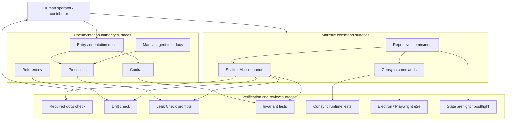

# Operational Baseline Reference v0

Status: first-pass reference
Role: authoritative operational reference
Scope: documentation and operational orientation only

---

## 1. Purpose

This baseline captures the current stable operational shape of `consync-core` and
ScaffoldAI so humans, future AI tools, contributors, and future reentry sessions
can understand what the system currently proves.

Operational clarity matters before automation because unclear manual behavior is
easy to encode incorrectly. The current system intentionally favors visible
commands, explicit contracts, reviewable checks, and human judgment before any
future expansion of machine-driven behavior.

Principle:

> Automation should remove friction from stable manual processes, not invent missing structure.

This document is an orientation layer. It names the current command surfaces,
check semantics, documentation hierarchy, and high-level relationships without
adding runtime behavior.

Visual companion:
`.scaffoldai/reference/scaffoldai-flowchart-v0.reference.md` is the supporting
visual operational/documentation map. This baseline remains the textual
operational orientation reference.

---

## 2. Current Stable Operational State

The current baseline has these stable layers:

- **Consync**: the product/runtime surface being built from this repo. Product
  verification is currently exposed through fast runtime checks and
  Electron/Playwright e2e checks.
- **ScaffoldAI**: the repo-local process and coordination harness. It owns
  `.scaffoldai/` process docs, contracts, live state, streams, agents, skills,
  and verification references.
- **MCP**: a controlled local stdio access layer over bounded ScaffoldAI
  capabilities and state. It is diagnostic and manually invoked; it is not a
  command execution layer or workflow authority.
- **Gatekeeper**: the recommendation and boundary surface for classifying work
  and preserving process constraints. Gatekeeper output is advisory unless a
  separate human-approved workflow makes it actionable.
- **Leak Check**: a manual review surface for surfacing drift, unclear terms,
  weak assumptions, and future-risk signals that ordinary verification may not
  catch.
- **Deterministic Makefile checks**: readable local commands that group
  ScaffoldAI, Consync, and repo-level verification surfaces.
- **Invariant enforcement**: hard tests and scripts that fail on forbidden
  behavior, missing required structure, or broken contracts.
- **Repo-level audits**: bundled checks that combine process, product, state,
  and e2e verification when a broader confidence pass is needed.

---

## 3. Operational Command Surface

### ScaffoldAI Surface

| Command | Purpose | Expected scope | Semantics |
| --- | --- | --- | --- |
| `make scaffoldai-status` | Print branch and `git status --short` for process work. | Repo state visibility only. | INFO |
| `make scaffoldai-docs-check` | Verify required ScaffoldAI docs exist. | Required docs listed in `scripts/check-scaffoldai-docs.js`. | PASS/FAIL |
| `make scaffoldai-drift-check` | Scan active ScaffoldAI docs for known drift-risk wording. | Review-oriented docs scan with negative and historical context handling. | INFO/WARN, command still passes |
| `make scaffoldai-leak-check` | Print manual Leak Check prompts. | Human review prompts from `.scaffoldai/process/leak-check.process.md`. | INFO |
| `make scaffoldai-test` | Run the ScaffoldAI process/harness bundle. | Status, docs check, drift check, `npm run verify:scaffoldai`, leak prompts. | INFO/WARN/FAIL |

### Consync Surface

| Command | Purpose | Expected scope | Semantics |
| --- | --- | --- | --- |
| `make consync-test` | Run fast product/runtime verification. | `npm run verify:consync`; excludes Electron/Playwright e2e. | FAIL on verification failure |
| `make consync-e2e` | Run Electron/Playwright verification. | `npm run verify:consync:e2e`; may bind local `127.0.0.1`. | FAIL on e2e failure |

### Repo Surface

| Command | Purpose | Expected scope | Semantics |
| --- | --- | --- | --- |
| `make repo-status` | Print current branch and short git status. | Repo state visibility only. | INFO |
| `make repo-test` | Run the normal combined confidence bundle. | `make scaffoldai-test` plus `make consync-test`. | INFO/WARN/FAIL |
| `make repo-full-audit` | Run the broad audit path. | `make repo-test` plus `make verify-full`; may include e2e and state pre/postflight. | INFO/WARN/FAIL |

---

## 4. Check Semantics

### INFO

INFO means the command found context useful for human review. It may include:

- historical references
- negative examples
- drift-aware references
- status output
- manual review prompts
- advisory observations

INFO does not mean the system is unhealthy. It is a review-oriented signal.

### WARN

WARN means possible active drift or unclear semantics were detected. A warning may
identify:

- ambiguous wording
- possible active drift
- possible unclear boundaries
- language that needs human review before being promoted or ignored

WARN requires review, but not every warning should become a failing invariant.
Some warning-oriented surfaces are intentional because they help humans inspect
soft drift without blocking all work.

### FAIL

FAIL means a hard check did not pass. Typical causes include:

- hard invariant violations
- active forbidden behavior
- missing required structure
- broken verification
- tests returning a non-zero exit code

FAIL is for conditions the system already knows how to reject. It should remain
narrow enough to be trustworthy.

Not all signal should become failure. Review-oriented checks exist because some
architecture risks are real before they are deterministic.

---

## 5. Manual-First Philosophy

The system must function manually before automation is considered. Current
operations are built around explicit commands, visible evidence, and
human-controlled decisions.

Deterministic checks are allowed and encouraged. They make stable rules cheap to
verify. Autonomous behavior is intentionally deferred until the manual process is
clear, tested, and governed by explicit authority rules.

Current ScaffoldAI behavior is advisory and coordinating. It is not an automatic
workflow engine, an autonomous execution layer, or a substitute for human
approval.

---

## 6. Current Documentation Hierarchy

### Entry and Orientation Docs

- `.scaffoldai/README.md` is the main ScaffoldAI orientation doc.
- `AGENTS.md` is the Codex entry point and should point back to `.scaffoldai/`
  instead of duplicating the process model.
- `.github/` is a thin tool adapter layer, not the canonical process source.

### Contracts

Authoritative contracts live in `.scaffoldai/contracts/`. They define system
identity, boundary rules, gatekeeper recommendation structure, MCP/client
interaction boundaries, state integrity, and separation constraints.

Contracts are the primary authority when reference docs, examples, or planning
notes conflict.

### Processes

Process docs live in `.scaffoldai/process/`. They describe how humans and tools
carry out work, including runbooks, manual execution flow, AI context, feature
packet flow, and leak checks.

Processes guide execution but should not override active contracts.

### References

Reference docs live in `.scaffoldai/reference/`. They explain stable context,
profiles, packet examples, MCP boundaries, setup notes, and orientation maps.

References are supporting operational memory. They should be clear enough for
reentry, but they are not a replacement for contracts or live state.

### Agents

Agent role definitions live in `.scaffoldai/agents/`. Current roles include
Preflight, Intake, Verify, Closeout, Reentry, Gatekeeper, and Entry Adapter.

Agents are manually invoked. The Entry Adapter may recommend a next agent when
classification is unclear, but it does not dispatch work.

### Tests and Check Surfaces

Verification surfaces include:

- Makefile commands at the repo root
- `scripts/check-scaffoldai-docs.js`
- `src/test/verify.js`
- ScaffoldAI invariant and boundary tests
- Consync runtime tests
- Electron/Playwright e2e checks
- state preflight/postflight checks in broader audit paths

These surfaces provide evidence. Human approval remains separate from evidence.

---

## 7. Mermaid Documentation / Operational Map

This map is intentionally high-level. It shows authority and evidence flow, not
file-level dependencies.

---

## 8. Non-Goals

This document is not:

- a runtime orchestrator
- an automatic dependency graph
- a workflow engine
- an agent execution graph
- a live architecture monitor
- a source of new command behavior
- a replacement for contracts, live state, or verification evidence

---

## 9. Future Direction

Future reference work may expand into:

- an approval and authority model
- richer documentation maps
- visual authority layers
- capability mapping
- clearer Gatekeeper recommendation examples
- future MCP-capable client orientation

These are conceptual directions only. They do not describe current runtime
behavior and should not be treated as implementation commitments.
