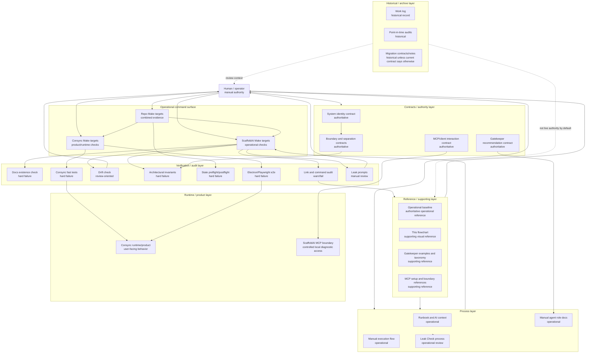

# ScaffoldAI Flowchart Reference v0

Status: first-pass reference
Role: supporting visual operational reference
Scope: explanatory documentation map only

---

## 1. Purpose

This flowchart exists to make the current ScaffoldAI operating model easier to
see at a glance. The repo now has stable command surfaces, contracts, process
docs, reference docs, checks, and runtime boundaries; a visual map helps humans
and future AI tools orient without reconstructing the structure from scattered
files.

Visual mapping matters because it exposes structure that prose can hide:
authority layers, review surfaces, runtime boundaries, and places where future
work may need clearer ownership. ScaffoldAI is intentionally layered so that
human decisions, operational commands, contracts, processes, references,
verification, and product runtime behavior remain distinguishable.

Operational clarity matters before automation. A manual process should be
visible, stable, and reviewable before any future tooling tries to reduce its
friction.

This map is explanatory. It is not executable, not a runtime graph, and not
authoritative by itself. It supports the authoritative contracts, operational
baseline, process docs, and verification surfaces.

---

## 2. Layer Overview

- **Human/operator layer**: the human chooses work, approves actions, interprets
  review signals, and decides when evidence is sufficient.
- **Operational command surface**: Makefile targets expose deterministic local
  checks and grouped verification paths.
- **Contracts/authority layer**: `.scaffoldai/contracts/` defines binding
  boundaries, identity, recommendation rules, MCP interaction rules, and state
  integrity expectations.
- **Process layer**: `.scaffoldai/process/`, `.scaffoldai/agents/`, and
  `.scaffoldai/skills/` describe manual procedures, agent roles, leak checks,
  and execution guidance.
- **Reference/supporting layer**: `.scaffoldai/reference/`, examples, and setup
  notes provide orientation, packet examples, capability profiles, and visual
  maps.
- **Verification/audit layer**: deterministic scripts, invariant tests, drift
  checks, link audits, state checks, and e2e tests produce evidence.
- **Runtime/product layer**: Consync runtime and Electron/UI behavior live in
  product surfaces and are verified through Consync command lanes.
- **Historical/archive layer**: work logs, migration notes, and audits preserve
  past decisions and should not be treated as live authority unless a current
  contract points to them.

---

## 3. Primary Mermaid Operational Flow

Read this top-down as an authority and evidence map. It is not a dependency
graph. The arrows show how humans use operational surfaces and docs to obtain
evidence, preserve boundaries, and keep Consync runtime verification separate
from ScaffoldAI process verification.

---

## 4. Command Surface Section

### ScaffoldAI Commands

| Command | What it proves | Semantics |
| --- | --- | --- |
| `make scaffoldai-test` | Bundled ScaffoldAI process confidence: status, docs, link audit, drift, ScaffoldAI verifier, and leak prompts. | Mixed INFO/WARN/FAIL |
| `make scaffoldai-drift-check` | Active docs do not contain warning-level known drift language. | Review-oriented INFO/WARN; command passes without warnings |
| `make scaffoldai-link-audit` | Referenced `.scaffoldai` docs, Make targets, package scripts, and key authority roles remain coherent. | WARN for review-only live/generated paths; FAIL for missing stable references/commands |
| `make scaffoldai-leak-check` | Manual leak prompts are visible for human review. | INFO/manual review |

### Consync Commands

| Command | What it proves | Semantics |
| --- | --- | --- |
| `make consync-test` | Fast Consync product/runtime checks pass without Electron e2e. | Hard FAIL on verification failure |
| `make consync-e2e` | Electron/Playwright e2e behavior passes. | Hard FAIL on e2e failure |

### Repo Commands

| Command | What it proves | Semantics |
| --- | --- | --- |
| `make repo-test` | ScaffoldAI process checks and Consync fast checks both pass. | Mixed INFO/WARN/FAIL |
| `make repo-full-audit` | Broad repo confidence path passes, including `verify-full` and e2e where available. | Hard FAIL on verification failure; may require local server permission |

Warning-oriented checks are intentional. They preserve review signal for drift,
live/generated path semantics, and manual leak questions without pretending
every useful signal is a hard invariant.

---

## 5. Authority Layer Section

- **Authoritative contracts**: `.scaffoldai/contracts/` and the system identity
  contract define binding boundaries and should win when supporting references
  conflict.
- **Authoritative operational reference**:
  `.scaffoldai/reference/operational-baseline-v0.reference.md` captures the
  current stable operational baseline.
- **Operational process docs**: `.scaffoldai/process/`, `.scaffoldai/agents/`,
  and `.scaffoldai/skills/` guide manual process coordination and agent usage.
- **Supporting references**: `.scaffoldai/reference/` docs, packet examples,
  capability profiles, MCP setup notes, and this visual map help readers
  navigate the system.
- **Historical/archive docs**: audits, migration records, and work logs preserve
  context and decisions; they are review material unless current contracts make
  a specific part active.
- **Adapter-only surfaces**: `.github/` is a tool integration adapter and should
  point back to `.scaffoldai/` for canonical process behavior.

---

## 6. Known Seams / Open Questions

- The approval/authority model is still mostly expressed through human practice,
  contracts, and command output. A richer approval map is deferred.
- Future MCP-capable clients are possible, but current MCP remains controlled,
  local, diagnostic, and manually invoked.
- `make scaffoldai-link-audit` currently treats generated/live path classes such
  as `.scaffoldai/tmp/` and some `.scaffoldai/state/` references as review-only
  warnings. That warning class should remain visible until it is explicitly
  documented as accepted or made more precise.
- Live/generated state path semantics are intentionally not flattened into a
  single link rule. Some paths are expected to exist only after a command or
  workflow creates them.
- Historical records contain useful context and stale terminology. The boundary
  between historical evidence and active authority should stay explicit.
- Gatekeeper recommendation examples are advisory and supporting; they should
  not drift into assignment, approval, execution, or hidden routing language.
- Future visual maps may need separate overlays for authority, capability,
  verification, MCP client access, and historical context.

These seams are visible by design. The map should help pressure-test them, not
hide them.

---

## 7. Non-Goals

This document is not:

- a workflow engine
- a live dependency graph
- runtime orchestration
- autonomous coordination
- an execution graph
- an automatic graph generator
- a replacement for contracts, process docs, verification evidence, or human
  approval

---

## 8. Future Direction

Future versions may add:

- richer layered diagrams
- authority overlays
- capability overlays
- verification flow overlays
- MCP-capable client mapping
- clearer visual treatment of generated/live state paths

These are future conceptual possibilities only. They do not describe current
runtime behavior and should not be treated as implementation commitments.
