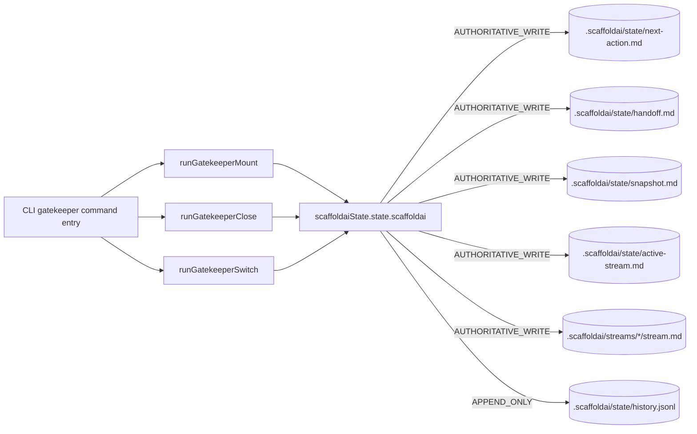
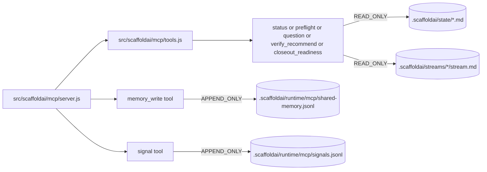
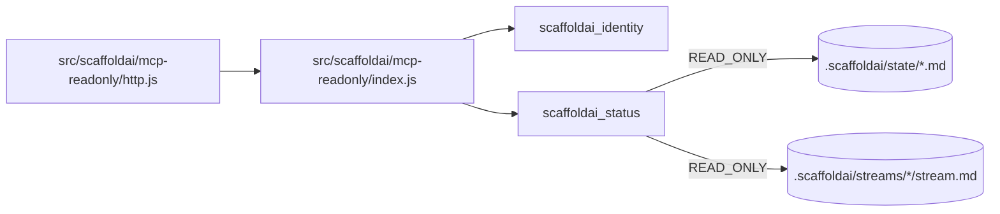
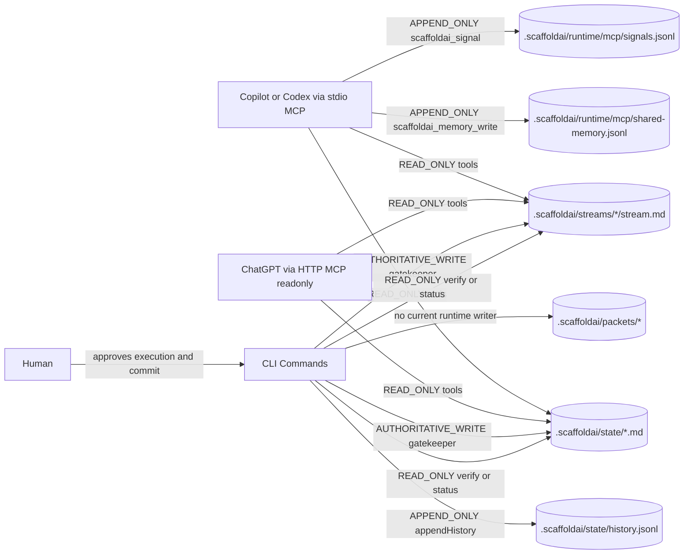

# ScaffoldAI State Write Surfaces Reference

Status: CURRENT REFERENCE
Role: operational reference for state mutation boundaries

## Purpose

Map every known code path that reads or mutates ScaffoldAI operational state so future sim-mode and MCP authority work can be scoped safely.

This document covers current behavior only. It does not grant new authority.

## State Surfaces Covered

- .scaffoldai/state/*
- .scaffoldai/streams/*
- .scaffoldai/packets/*

## Classification Legend

- READ_ONLY: may read state but does not mutate covered surfaces.
- APPEND_ONLY: may append records, no overwrite/delete of authoritative files.
- AUTHORITATIVE_WRITE: may create/overwrite authoritative state files.
- DESTRUCTIVE_WRITE: may delete or rename covered files.
- UNKNOWN_REVIEW_REQUIRED: behavior is unclear and must be reviewed before relying on it.

## Direct Loop-State Function Map

Only direct ScaffoldAI loop-state surfaces are listed below.

### CLI Entrypoints To State Writers

- Command entry: src/scaffoldai/commands/gatekeeper.cmd.scaffoldai.js
- Delegates:
  - runGatekeeperMount -> src/lib/gatekeeperMount.auth.scaffoldai.js
  - runGatekeeperClose -> src/lib/gatekeeperClose.auth.scaffoldai.js
  - runGatekeeperSwitch -> src/lib/gatekeeperSwitch.auth.scaffoldai.js
- Canonical state writer helper:
  - src/lib/scaffoldaiState.state.scaffoldai.js

### Canonical Loop-State Files Affected By CLI Gatekeeper Flows

- .scaffoldai/state/next-action.md
- .scaffoldai/state/handoff.md
- .scaffoldai/state/snapshot.md
- .scaffoldai/state/active-stream.md
- .scaffoldai/state/history.jsonl
- .scaffoldai/streams/*/stream.md

## Diagram: CLI Surface

## Diagram: MCP Stdio Surface

Current stance: stdio MCP does not perform authoritative loop-state writes to .scaffoldai/state/*.md or .scaffoldai/streams/*/stream.md.

## Diagram: MCP HTTP Surface

Current stance: MCP HTTP is read-only and has no write-capable loop-state tool registration.

## Diagram: Combined State Impact Map

```mermaid
flowchart TB
    Human[Human]
    CLI[CLI]
    StdioClients[Copilot or Codex or Claude via MCP stdio]
    HttpClient[ChatGPT via MCP HTTP readonly]

    Next[(.scaffoldai/state/next-action.md)]
    Handoff[(.scaffoldai/state/handoff.md)]
    Snapshot[(.scaffoldai/state/snapshot.md)]
    Active[(.scaffoldai/state/active-stream.md)]
    Hist[(.scaffoldai/state/history.jsonl)]
    StreamDoc[(.scaffoldai/streams/*/stream.md)]
    SharedMem[(.scaffoldai/runtime/mcp/shared-memory.jsonl)]
    SignalLog[(.scaffoldai/runtime/mcp/signals.jsonl)]
    Packets[(.scaffoldai/packets/*)]

    Human -->|approves and directs| CLI
    Human -->|requests observations| StdioClients
    Human -->|requests observations| HttpClient

    CLI -->|AUTHORITATIVE_WRITE| Next
    CLI -->|AUTHORITATIVE_WRITE| Handoff
    CLI -->|AUTHORITATIVE_WRITE| Snapshot
    CLI -->|AUTHORITATIVE_WRITE| Active
    CLI -->|AUTHORITATIVE_WRITE| StreamDoc
    CLI -->|APPEND_ONLY| Hist

    StdioClients -->|READ_ONLY| Next
    StdioClients -->|READ_ONLY| Handoff
    StdioClients -->|READ_ONLY| Snapshot
    StdioClients -->|READ_ONLY| Active
    StdioClients -->|READ_ONLY| StreamDoc
    StdioClients -->|APPEND_ONLY| SharedMem
    StdioClients -->|APPEND_ONLY| SignalLog

    HttpClient -->|READ_ONLY| Next
    HttpClient -->|READ_ONLY| Handoff
    HttpClient -->|READ_ONLY| Snapshot
    HttpClient -->|READ_ONLY| Active
    HttpClient -->|READ_ONLY| StreamDoc

    CLI -->|no current runtime writer discovered| Packets
```

## Inventory: Runtime And Command Surfaces

| Surface | File / Symbol | Caller Surface | Covered Path(s) | Classification | Notes |
| --- | --- | --- | --- | --- | --- |
| State authority module | src/lib/scaffoldaiState.state.scaffoldai.js (writeNextAction, writeHandoff, writeSnapshot, writeActiveStream, writeStreamDoc) | helper/library | .scaffoldai/state/*.md, .scaffoldai/streams/*/stream.md | AUTHORITATIVE_WRITE | Canonical writer for operational state markdown files. |
| State history append | src/lib/scaffoldaiState.state.scaffoldai.js (appendHistory) | helper/library | .scaffoldai/state/history.jsonl | APPEND_ONLY | Creates file if missing, appends JSONL records. |
| Gatekeeper mount writes | src/lib/gatekeeperMount.auth.scaffoldai.js (executeMountWrites) | helper/library (called by CLI) | next-action.md, snapshot.md, streams/*/stream.md, state/history.jsonl | AUTHORITATIVE_WRITE + APPEND_ONLY | Uses scaffoldaiState write and append APIs. |
| Gatekeeper close writes | src/lib/gatekeeperClose.auth.scaffoldai.js (executeCloseWritesA/B) | helper/library (called by CLI) | handoff.md, snapshot.md, streams/*/stream.md, state/history.jsonl | AUTHORITATIVE_WRITE + APPEND_ONLY | Uses scaffoldaiState write and append APIs. |
| Gatekeeper switch writes | src/lib/gatekeeperSwitch.auth.scaffoldai.js (executeSwitchWrites) | helper/library (called by CLI) | active-stream.md, snapshot.md, streams/*/stream.md, state/history.jsonl | AUTHORITATIVE_WRITE + APPEND_ONLY | Uses scaffoldaiState write and append APIs. |
| Gatekeeper command entry | src/scaffoldai/commands/gatekeeper.cmd.scaffoldai.js | CLI | Indirect: delegates to gatekeeper auth modules above | AUTHORITATIVE_WRITE + APPEND_ONLY | Only mutating CLI entrypoint for operational state. |
| Consync run soft gate | src/scaffoldai/commands/consync-run.cmd.scaffoldai.js | CLI | Reads .scaffoldai/state/active-contract.json + next-action.md | READ_ONLY | Prompts approval but does not execute writes. |
| Dry-run check | src/scaffoldai/commands/dry-run-check.check.scaffoldai.js | CLI | Reads .scaffoldai/state/active-contract.json + next-action.md | READ_ONLY | Simulation only. |
| ScaffoldAI status | src/scaffoldai/commands/scaffoldai-status.cmd.scaffoldai.js + src/lib/scaffoldaiStatus.query.scaffoldai.js | CLI | Reads state and stream docs | READ_ONLY | Observation only. |
| ScaffoldAI preflight/question/verify/closeout recommendation paths | src/scaffoldai/commands/scaffoldai-preflight.cmd.scaffoldai.js, scaffoldai-question.cmd.scaffoldai.js, scaffoldai-verify.cmd.scaffoldai.js, scaffoldai-closeout.cmd.scaffoldai.js | CLI | Reads state and git | READ_ONLY | Closeout command reports readiness only. |
| Stdio MCP read tools | src/scaffoldai/mcp/tools.js (status/preflight/question/verify_recommend/closeout_readiness) | MCP stdio | Reads state and git | READ_ONLY | Declares execution_class READ_ONLY. |
| Stdio MCP signal tool | src/scaffoldai/mcp/signal.js | MCP stdio | .scaffoldai/runtime/mcp/signals.jsonl | APPEND_ONLY | Rotates/deletes only runtime signal log, not operational state. |
| Stdio MCP shared memory | src/scaffoldai/mcp/shared-memory.js | MCP stdio | .scaffoldai/runtime/mcp/shared-memory.jsonl | APPEND_ONLY | Writes append-only runtime shared-memory JSONL. |
| MCP snapshot export | src/scaffoldai/mcp/snapshot.js | npm script / MCP utility | .scaffoldai/tmp/mcp-runtime-snapshot.json | AUTHORITATIVE_WRITE (tmp only) | Writes tmp snapshot only, no state/stream authority files. |
| HTTP MCP readonly server | src/scaffoldai/mcp-readonly/http.js + index.js + tools/* | MCP HTTP | Reads status/identity only | READ_ONLY | No write-capable tools registered. |
| Handoff bundle command | src/scaffoldai/commands/handoff-bundle.process.scaffoldai.js | CLI | Reads handoff.md, snapshot.md | READ_ONLY | Prints bundle to stdout only. |
| Portable scaffold command | src/lib/portableScaffold.process.scaffoldai.js + src/scaffoldai/commands/portable.process.scaffoldai.js | CLI | Writes template files into target path (can include .scaffoldai files) | AUTHORITATIVE_WRITE (target-scoped) | Scaffolding utility; not part of live loop authority, but can write if target is this repo. |
| Integrity and handoff scripts | scripts/check-handoff-contract.js, scripts/check-scaffoldai-docs.js, scripts/check-scaffoldai-links-and-commands.js | npm script | Reads state/docs | READ_ONLY | Verification and docs audit only. |

## Inventory: Test Fixtures And Test Utilities

| Surface | File | Caller Surface | Covered Path(s) | Classification | Notes |
| --- | --- | --- | --- | --- | --- |
| State fixture writer helpers | src/test/state-integrity-checks.js, src/test/integration-handoff-bundle-cli.js, src/test/unit-get-in-flight-packet.js, src/test/unit-dry-run-check.js, src/test/unit-consync-run.js | test fixture | Temp .scaffoldai/state and .scaffoldai/streams fixtures | AUTHORITATIVE_WRITE + DESTRUCTIVE_WRITE | Test-only fixture setup/teardown, not runtime authority. |
| MCP signal/shared-memory test cleanup | src/test/mcp-transport-e2e.js, src/test/unit-scaffoldai-mcp-readonly.js | test fixture | tmp/signal and test files | DESTRUCTIVE_WRITE | Test cleanup only. |
| History append unit tests | src/test/unit-scaffoldai-history.test.js | test fixture | Temp .scaffoldai/state/history.jsonl | APPEND_ONLY + DESTRUCTIVE_WRITE | Validates appendHistory behavior and teardown. |

## Current Intended Policy

- Authoritative writes to .scaffoldai/state/*.md and .scaffoldai/streams/*/stream.md are centralized in scaffoldaiState.state.scaffoldai.js and reached via gatekeeper auth flows.
- .scaffoldai/state/history.jsonl is append-only observational history.
- Stdio MCP operational tools are read-only except:
  - scaffoldai_memory_write appends to .scaffoldai/runtime/mcp/shared-memory.jsonl
  - scaffoldai_signal appends/rotates .scaffoldai/runtime/mcp/signals.jsonl
- HTTP MCP surface is read-only and does not expose write tools.
- No current runtime path mutates .scaffoldai/packets.

## Authority Mismatches And Risk Notes

No hard policy violations were found in current runtime code. The following boundary risks are worth tracking:

1. Portable scaffold can write .scaffoldai content
- portable.process.scaffoldai command can copy template .scaffoldai files into any target path.
- This is intentional scaffolding behavior, but should remain outside normal live-loop state authority assumptions.

2. Generic helper naming inside canonical state module
- readFile/writeFile names are generic inside scaffoldaiState module; context is clear in-file but still broad names.
- Not a blocker; optional naming hardening is possible.

## MCP Write Access Status

- MCP stdio: has bounded append capability only (shared-memory JSONL and signals JSONL under runtime/mcp). No write access to authoritative state markdown files.
- MCP HTTP readonly: no write capability exposed.

## .scaffoldai/packets Status

- No runtime writer discovered for .scaffoldai/packets in src/scaffoldai, src/lib, or scripts surfaces.
- Packet archive remains a process/documentation artifact, not currently mutated by command or MCP runtime code.

## Mermaid Authority Map

## Follow-up Recommendations

1. Keep MCP append-only runtime artifacts confined to .scaffoldai/runtime/mcp and out of authoritative state and stream doc namespaces.
2. If stdio MCP state-write authority is expanded later, require explicit command-level boundary contracts and preserve HTTP read-only separation.
3. Consider optional helper naming hardening in scaffoldaiState module (for example writeStateFile/readStateFile) only if clarity issues continue.
